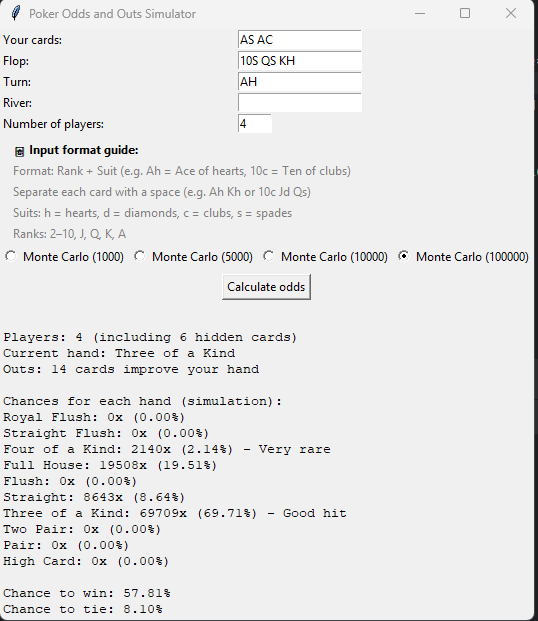

# ♠️ poker-handler

**Poker Handler** is a Monte Carlo-based Texas Hold'em odds and outs simulator.  
It calculates the probability of winning, tying, and improving your hand based on known cards and number of players.  

🎯 **Key Features**:
- Monte Carlo simulation with 1k, 5k, 10k or 100k iterations
- Outs calculation – number of cards that improve your hand
- Hand strength evaluation (pair, straight, flush, etc.)
- Win/tie probability tracking against multiple players
- Full input validation and duplicate prevention
- Clean Tkinter GUI – fast and responsive



📦 **Usage**:
1. Clone the repo
   
   ```bash
      git clone https://github.com/am-fbs/poker-handler.git


3. Run the script:

   ```bash
     python poker_handler.py

